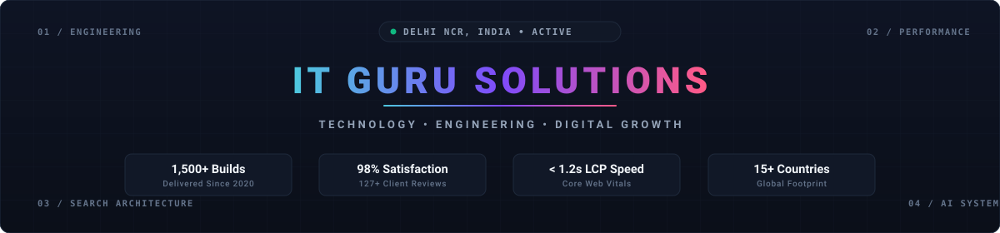

<div align="center">

  

  <br/><br/>

  <!-- Dynamic Animated Typing Header -->
  <a href="https://itgurusolutions.in/">
    
  </a>

  <br/>

  <!-- Quick Nav Badges -->
  <a href="https://itgurusolutions.in/"></a>
  <a href="https://itgurusolutions.in/locations/"></a>
  <a href="https://itgurusolutions.in/services/web-development/"></a>
  <a href="https://itgurusolutions.in/contact/"></a>

  <br/><br/>

  <p align="center">
    <b>IT Guru Solutions</b> is a premier digital technology and engineering agency headquartered in Delhi NCR, India. Since 2020, we have architected and deployed <b>1,500+ verified production builds across 15+ countries</b>. We specialize in sub-second <b>Next.js & React architectures</b>, resilient <b>mobile applications</b>, enterprise <b>cloud infrastructure</b>, and entity-first <b>Technical SEO / AI Answer Engine Optimization (AEO & GEO)</b>.
  </p>

  

</div>

<br/>

## 🛠️ Core Engineering Disciplines

<table>
  <tr>
    <td width="50%" valign="top">
      <h3>⚡ Full-Stack Next.js & React Engineering</h3>
      <p>Custom digital platforms engineered with <b>Next.js App Router, TypeScript, and serverless architectures</b> designed for sub-second Core Web Vitals, enterprise scalability, and high lead conversion rates.</p>
      <ul>
        <li><b>Frameworks:</b> Next.js 15, React 19, TypeScript, Node.js</li>
        <li><b>Styling & Systems:</b> Tailwind CSS, Shadcn UI, Radix, SCSS</li>
        <li><b>Performance:</b> 95+ Mobile Lighthouse, SSG/ISR rendering</li>
      </ul>
    </td>
    <td width="50%" valign="top">
      <h3>🔍 Technical SEO, AEO & Entity Architecture</h3>
      <p>Search authority engineered directly into codebase foundations. We design <b>nested JSON-LD schema graphs, semantic markup, and crawl architectures</b> built to win top Google rankings and Generative AI citations (ChatGPT, Perplexity, Google AI Overviews).</p>
      <ul>
        <li><b>Optimization:</b> Schema Graph, Crawl Optimization, Core Web Vitals</li>
        <li><b>Generative Search:</b> AEO (Answer Engine) & GEO (Generative Engine)</li>
        <li><b>Audit Suite:</b> Screaming Frog, SEMrush, Ahrefs, Search Console</li>
      </ul>
    </td>
  </tr>
  <tr>
    <td width="50%" valign="top">
      <h3>📱 Mobile & Cross-Platform Development</h3>
      <p>High-performance native and hybrid mobile applications for iOS and Android, built with secure backend integrations, local caching, fluid micro-interactions, and frictionless checkout flows.</p>
      <ul>
        <li><b>Mobile Stacks:</b> React Native, Flutter, Swift, Kotlin</li>
        <li><b>Backend Integration:</b> RESTful APIs, GraphQL, Firebase, Supabase</li>
        <li><b>Security:</b> OAuth 2.0, biometric auth, encrypted storage</li>
      </ul>
    </td>
    <td width="50%" valign="top">
      <h3>☁️ Cloud Infrastructure & DevOps</h3>
      <p>Resilient cloud deployment pipelines engineered for high availability, containerized microservices, automated CI/CD releases, security compliance, and 99.9% guaranteed uptime.</p>
      <ul>
        <li><b>Cloud & Edge:</b> AWS, Google Cloud, Vercel, Docker, Nginx</li>
        <li><b>Database Systems:</b> PostgreSQL, MongoDB, Redis, MySQL</li>
        <li><b>Payment Gateways:</b> Razorpay, Stripe, PayPal, UPI Integration</li>
      </ul>
    </td>
  </tr>
</table>

<div align="center">
  
</div>

<br/>

## 🚀 Featured Enterprise Builds & Client Platforms

A selected portfolio of production builds, client portals, and e-commerce platforms delivered across India, USA, UK, UAE, and worldwide.

<table>
  <thead>
    <tr>
      <th width="30%">Platform / Client</th>
      <th width="20%">Vertical</th>
      <th width="30%">Architecture & Tech</th>
      <th width="20%">Production Preview</th>
    </tr>
  </thead>
  <tbody>
    <tr>
      <td><b>MobileGadgetsWorld</b><br/><sub>High-conversion electronics & accessories e-commerce</sub></td>
      <td><code>E-Commerce</code></td>
      <td><code>Next.js</code> <code>TypeScript</code> <code>TailwindCSS</code> <code>Redux</code></td>
      <td><a href="https://mobilegadgetsworlds.vercel.app"><b>🚀 Live Preview ↗</b></a></td>
    </tr>
    <tr>
      <td><b>PayMyTrip</b><br/><sub>Flight, hotel & vacation package booking platform</sub></td>
      <td><code>Travel & Hospitality</code></td>
      <td><code>JavaScript</code> <code>Booking Engine</code> <code>API Integration</code></td>
      <td><a href="https://pay-my-trip.vercel.app"><b>🚀 Live Preview ↗</b></a></td>
    </tr>
    <tr>
      <td><b>Firmsap Tech Rentals</b><br/><sub>Enterprise IT equipment & laptop rental portal</sub></td>
      <td><code>B2B Rental Tech</code></td>
      <td><code>Next.js</code> <code>Product Catalog</code> <code>Technical SEO</code></td>
      <td><a href="https://firmsap.vercel.app"><b>🚀 Live Preview ↗</b></a></td>
    </tr>
    <tr>
      <td><b>Care Health Nurses</b><br/><sub>Healthcare staffing & verified nursing care portal</sub></td>
      <td><code>Healthcare & Medical</code></td>
      <td><code>HTML5</code> <code>SCSS</code> <code>Conversion Funnels</code></td>
      <td><a href="https://carehealthnurses.vercel.app"><b>🚀 Live Preview ↗</b></a></td>
    </tr>
    <tr>
      <td><b>Mars Elevators</b><br/><sub>Industrial elevators & engineering equipment showcase</sub></td>
      <td><code>Engineering & Heavy Tech</code></td>
      <td><code>Corporate Web</code> <code>Responsive UI</code> <code>SEO</code></td>
      <td><a href="https://marselevators.vercel.app"><b>🚀 Live Preview ↗</b></a></td>
    </tr>
    <tr>
      <td><b>iStudio & Loaft Interior Design</b><br/><sub>Luxury architectural portfolio & space planning</sub></td>
      <td><code>Architecture & Interior</code></td>
      <td><code>SCSS</code> <code>Visual Portfolio</code> <code>GSAP Animations</code></td>
      <td><a href="https://i-studio-interior-design.vercel.app"><b>🚀 Live Preview ↗</b></a></td>
    </tr>
  </tbody>
</table>

<div align="center">
  
</div>

<br/>

## 🎨 Interactive Frontend & Animation Lab

Our open-source laboratory features cutting-edge GSAP timelines, WebGL/Canvas effects, 3D CSS transforms, and DOM physics experiments.

<table>
  <tr>
    <td align="center" width="33%">
      <h4>🌟 3D Transforms & Canvas</h4>
      <a href="https://3d-rotation-login-signup-box.vercel.app"><b>3D Rotation Auth Box ↗</b></a><br/><br/>
      <a href="https://drippin-3d.vercel.app"><b>Drippin 3D WebGL ↗</b></a><br/><br/>
      <a href="https://pokemon-3d-rotation.vercel.app"><b>3D Card Physics ↗</b></a>
    </td>
    <td align="center" width="33%">
      <h4>⚡ GSAP & Kinetic FX</h4>
      <a href="https://gsap-scramble-text-animation.vercel.app"><b>GSAP Scramble Text ↗</b></a><br/><br/>
      <a href="https://neon-noice.vercel.app"><b>Neon Noise Canvas ↗</b></a><br/><br/>
      <a href="https://fuild-animation.vercel.app"><b>Fluid Particle Canvas ↗</b></a>
    </td>
    <td align="center" width="33%">
      <h4>🎯 Physics & UI Interactions</h4>
      <a href="https://tuggable-light-bulb.vercel.app"><b>Tuggable Light Bulb ↗</b></a><br/><br/>
      <a href="https://emoji-reactions.vercel.app"><b>Interactive Reactions ↗</b></a><br/><br/>
      <a href="https://scroll-animation-olive.vercel.app"><b>Kinetic Scroll Suite ↗</b></a>
    </td>
  </tr>
</table>

<div align="center">
  
</div>

<br/>

## 💻 Technology Ecosystem

<div align="center">

| Domain | Verified Stack & Tools |
| :--- | :--- |
| **Frontend & UI** |        |
| **Backend & APIs** |       |
| **Mobile & Hybrid** |     |
| **Cloud & DevOps** |        |
| **Search & Growth** |      |

</div>

<div align="center">
  
</div>

<br/>

## 📐 The 4-Phase Documented Engineering Delivery

Every client build and enterprise engagement is executed through our verified 4-phase methodology:

```
┌────────────────────────────────┐       ┌────────────────────────────────┐
│ 01. Discovery & Architecture   │  ───▶ │ 02. Next.js Build & QA Staging │
│ • Written Scope & KPI Roadmap  │       │ • Sub-Second Page Speeds (CWV) │
│ • Competitor & Keyword Gaps    │       │ • WCAG Accessibility Review    │
└────────────────────────────────┘       └────────────────────────────────┘
               │                                         │
               ▼                                         ▼
┌────────────────────────────────┐       ┌────────────────────────────────┐
│ 03. Search & Conversion Layer  │  ───▶ │ 04. Production Launch & GA4    │
│ • Nested JSON-LD Schema Graphs │       │ • GA4 & Search Console Setup   │
│ • High-Intent Copy & Link Web  │       │ • Milestone Sign-Off & Handover│
└────────────────────────────────┘       └────────────────────────────────┘
```

<div align="center">
  
</div>

<br/>

## 📊 GitHub Activity & Repository Metrics

<div align="center">
  
  &nbsp;&nbsp;
  
</div>

<br/>

<div align="center">
  
</div>

<br/>

## 📬 Collaborate With Our Engineering Team

Looking to build a high-performance Next.js web application, modernize your mobile architecture, or execute an enterprise Technical SEO & AEO program?

<div align="center">

[](https://itgurusolutions.in/contact/)
[](https://itgurusolutions.in/services/)
[](tel:+918595505547)

<br/>

**IT Guru Solutions**  
📍 *Headquarters:* Delhi NCR, India (Serving India, USA, UK, Canada, UAE, Australia)  
🌐 *Official Website:* [https://itgurusolutions.in/](https://itgurusolutions.in/)  
📧 *Direct Email:* [itgurusolutions07@gmail.com](mailto:itgurusolutions07@gmail.com)  
📺 *YouTube Channel:* [@ITGuruSolutions](https://www.youtube.com/@ITGuruSolutions)

---

<sub>© 2020–2026 IT Guru Solutions. All rights reserved. Engineering modern digital growth with sub-second performance and technical precision.</sub>

</div>
