  

    

  <!-- Neutral Metadata Badges & Single Gradient CTA -->
  
  
  
  

    

  

    <b>IT Guru Solutions</b> is a technology and digital engineering firm headquartered in Delhi NCR, India. Since 2020, our engineering and search architecture teams have delivered <b>1,500+ verified production deployments across 15+ countries</b>. We build high-speed <b>Next.js web platforms</b>, native and cross-platform <b>mobile systems</b>, and entity-structured <b>Technical SEO & AI Search architectures (AEO/GEO)</b>.
  

   

  

    

  

 

## 🛠️ Core Engineering Disciplines

<table>
  <tr>
    <td width="50%" valign="top">
      <h3>⚡ Full-Stack Next.js & React Engineering</h3>
      
Production web applications engineered with Next.js App Router, TypeScript, and serverless architectures designed for sub-second Core Web Vitals, enterprise scalability, and high lead conversion rates.

      <ul>
        <li><code>Next.js 15</code> <code>React 19</code> <code>TypeScript</code> <code>Node.js</code></li>
        <li><code>Tailwind CSS</code> <code>Shadcn UI</code> <code>Radix</code> <code>Redux Toolkit</code></li>
        <li>SSG / ISR rendering with sub-1.2s Largest Contentful Paint (LCP)</li>
      </ul>
    </td>
    <td width="50%" valign="top">
      <h3>🔍 Technical SEO, AEO & Entity Architecture</h3>
      
Search visibility built directly into application architecture. We design nested JSON-LD schema graphs, semantic HTML, and crawl pathways to win top Google rankings and AI Answer Engine citations.

      <ul>
        <li><code>Schema Graph Architecture</code> <code>Crawl Budget Optimization</code> <code>CWV</code></li>
        <li><code>AEO (Answer Engine Optimization)</code> <code>GEO (Generative Engine)</code></li>
        <li>Entity-based indexing for Google Search, ChatGPT Search, and Perplexity</li>
      </ul>
    </td>
  </tr>
  <tr>
    <td width="50%" valign="top">
      <h3>📱 Mobile & Cross-Platform Systems</h3>
      
High-performance native and cross-platform mobile applications for iOS and Android, built with resilient backend APIs, offline synchronization, and secure transaction workflows.

      <ul>
        <li><code>React Native</code> <code>Flutter</code> <code>Swift</code> <code>Kotlin</code></li>
        <li><code>RESTful APIs</code> <code>GraphQL</code> <code>Firebase</code> <code>Supabase</code></li>
        <li>Biometric authentication, local SQLite/Room caching, real-time sync</li>
      </ul>
    </td>
    <td width="50%" valign="top">
      <h3>☁️ Cloud Infrastructure & DevOps</h3>
      
Cloud architectures engineered for 99.9% uptime, containerized microservices, automated CI/CD deployments, and enterprise data security.

      <ul>
        <li><code>AWS</code> <code>Google Cloud Platform</code> <code>Vercel</code> <code>Docker</code></li>
        <li><code>PostgreSQL</code> <code>MongoDB</code> <code>Redis</code> <code>MySQL</code></li>
        <li>PCI-compliant payment gateways: Razorpay, Stripe, PayPal, UPI</li>
      </ul>
    </td>
  </tr>
</table>

  

 

## 📐 Documented Engineering Pipeline

  

 

  

 

## 🔍 Entity Architecture & AI Search Engine System

  

  

 

## 🚀 Verified Production Builds & Client Platforms

A selected catalog of production web applications, client portals, and e-commerce platforms delivered across India, USA, UK, UAE, and global markets.

<table>
  <thead>
    <tr>
      <th width="32%">Client / Platform</th>
      <th width="20%">Vertical</th>
      <th width="30%">Architecture Stack</th>
      <th width="18%">Deployment</th>
    </tr>
  </thead>
  <tbody>
    <tr>
      <td><b>MobileGadgetsWorld</b> High-conversion electronics e-commerce</td>
      <td><code>E-Commerce & Retail</code></td>
      <td><code>Next.js</code> <code>TypeScript</code> <code>TailwindCSS</code></td>
      <td><a href="https://mobilegadgetsworlds.vercel.app"><b>Production URL ↗</b></a></td>
    </tr>
    <tr>
      <td><b>PayMyTrip</b> Travel booking engine & itinerary management</td>
      <td><code>Travel & Hospitality</code></td>
      <td><code>JavaScript</code> <code>Booking Engine</code> <code>APIs</code></td>
      <td><a href="https://pay-my-trip.vercel.app"><b>Production URL ↗</b></a></td>
    </tr>
    <tr>
      <td><b>Firmsap Rentals</b> B2B enterprise IT equipment & laptop rentals</td>
      <td><code>Enterprise Tech Rental</code></td>
      <td><code>Next.js</code> <code>Catalog Engine</code> <code>SEO</code></td>
      <td><a href="https://firmsap.vercel.app"><b>Production URL ↗</b></a></td>
    </tr>
    <tr>
      <td><b>Care Health Nurses</b> Healthcare staffing & verified nursing care</td>
      <td><code>Healthcare & Medical</code></td>
      <td><code>HTML5</code> <code>SCSS</code> <code>Lead Architecture</code></td>
      <td><a href="https://carehealthnurses.vercel.app"><b>Production URL ↗</b></a></td>
    </tr>
    <tr>
      <td><b>Mars Elevators</b> Industrial elevators & engineering equipment</td>
      <td><code>Heavy Industry & Tech</code></td>
      <td><code>Corporate Web</code> <code>Catalog UI</code> <code>SEO</code></td>
      <td><a href="https://marselevators.vercel.app"><b>Production URL ↗</b></a></td>
    </tr>
    <tr>
      <td><b>iStudio & Loaft Interior</b> Architectural design studio portfolio</td>
      <td><code>Architecture & Design</code></td>
      <td><code>SCSS</code> <code>Portfolio System</code> <code>GSAP</code></td>
      <td><a href="https://i-studio-interior-design.vercel.app"><b>Production URL ↗</b></a></td>
    </tr>
  </tbody>
</table>

  

 

## 🧪 Interactive Frontend & Animation Laboratory

We maintain an active open-source laboratory exploring GSAP timelines, WebGL canvas shaders, 3D CSS transforms, and DOM physics interactions.

<table>
  <tr>
    <td align="center" width="33%">
      <b>3D Transforms & WebGL</b>  
      <a href="https://3d-rotation-login-signup-box.vercel.app"><code>3D Rotation Box ↗</code></a>  
      <a href="https://drippin-3d.vercel.app"><code>Drippin 3D Canvas ↗</code></a>  
      <a href="https://pokemon-3d-rotation.vercel.app"><code>3D Perspective Cards ↗</code></a>
    </td>
    <td align="center" width="33%">
      <b>GSAP & Kinetic FX</b>  
      <a href="https://gsap-scramble-text-animation.vercel.app"><code>GSAP Scramble Text ↗</code></a>  
      <a href="https://neon-noice.vercel.app"><code>Neon Noise Canvas ↗</code></a>  
      <a href="https://fuild-animation.vercel.app"><code>Fluid Dynamics UI ↗</code></a>
    </td>
    <td align="center" width="33%">
      <b>Micro-Interactions</b>  
      <a href="https://tuggable-light-bulb.vercel.app"><code>Tuggable Light Bulb ↗</code></a>  
      <a href="https://emoji-reactions.vercel.app"><code>Interactive Reactions ↗</code></a>  
      <a href="https://scroll-animation-olive.vercel.app"><code>Kinetic Scroll Suite ↗</code></a>
    </td>
  </tr>
</table>

  

 

## 💻 Verified Technology Stack

| Domain | Enterprise Stack |
| :--- | :--- |
| **Frontend Frameworks** |      |
| **Backend & APIs** |      |
| **Mobile Engineering** |     |
| **Cloud & DevOps** |       |
| **Search & Analytics** |     |

  

 

## 📬 Commercial Engagements & Technical Discovery

Speak directly with our senior full-stack architects and technical SEO leads in Delhi NCR.

  

**IT Guru Solutions**  
📍 *Headquarters:* Delhi NCR, India (Serving India, USA, UK, Canada, UAE, Australia)  
🌐 *Official Website:* [https://itgurusolutions.in/](https://itgurusolutions.in/)  
📞 *Direct Line:* [+91 8595505547](tel:+918595505547)  
📧 *Inquiries:* [itgurusolutions07@gmail.com](mailto:itgurusolutions07@gmail.com)  

---

© 2020–2026 IT Guru Solutions. Enterprise web engineering, technical SEO, and cloud infrastructure.

