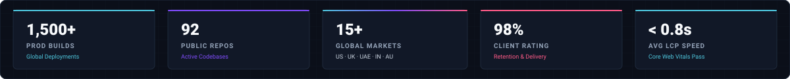
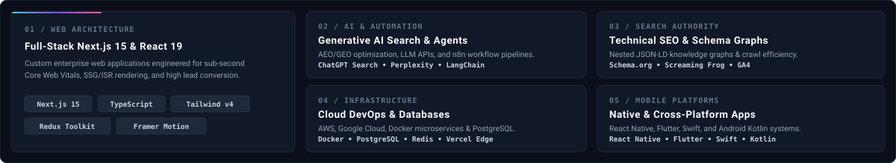
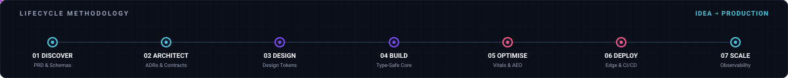
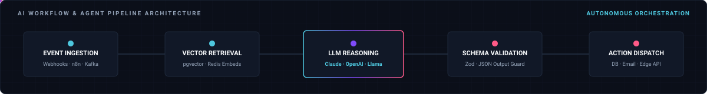
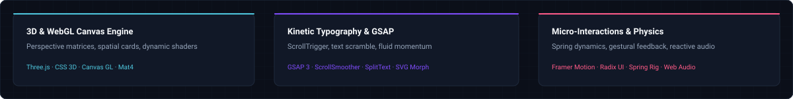

<div align="center">

<!-- HERO BANNER -->
<a href="https://itgurusolutions.in" target="_blank" rel="noopener noreferrer">
  
</a>

<br/><br/>

<!-- SYSTEM STATUS & IDENTITY BADGES -->
[](https://itgurusolutions.in)
[](https://github.com/ITGuruSolutions)
[](https://itgurusolutions.in)
[](https://itgurusolutions.in)
[](https://itgurusolutions.in)

<br/>

<!-- QUICK NAVIGATION -->
[`ABOUT`](#01--about) &nbsp;·&nbsp;
[`SYSTEMS`](#02--engineering-systems) &nbsp;·&nbsp;
[`LIFECYCLE`](#03--lifecycle-methodology) &nbsp;·&nbsp;
[`SEARCH & AI`](#04--search-architecture--aeo--geo) &nbsp;·&nbsp;
[`AI WORKFLOWS`](#05--ai-automation--agent-workflows) &nbsp;·&nbsp;
[`STACK`](#06--technology-network) &nbsp;·&nbsp;
[`BUILDS`](#07--flagship-engineering-builds) &nbsp;·&nbsp;
[`CASE STUDY`](#08--case-study-mobilegadgetsworld) &nbsp;·&nbsp;
[`LAB`](#09--interactive--motion-lab) &nbsp;·&nbsp;
[`STATUS`](#10--live-engineering-status) &nbsp;·&nbsp;
[`INQUIRIES`](#11--commercial-inquiries)

<br/><br/>

<!-- ENGINEERING METRICS CARD -->


<br/><br/>


</div>

<br/>

## 01 / ABOUT

**IT Guru Solutions** is a technology and digital engineering firm headquartered in Delhi NCR, India. Since 2020, our engineering and search architecture teams have delivered **1,500+ verified production deployments across 15+ countries**. 

We build high-concurrency **Next.js web platforms**, enterprise **e-commerce engines**, native and cross-platform **mobile applications**, and entity-structured **Technical SEO & AI Search architectures (AEO/GEO)**.

```
SYSTEM ARCHITECTURE: ZERO-TRUST · TYPE-SAFE · CLOUD-NATIVE · SEARCH-INDEXED
HEADQUARTERS:        DELHI NCR, INDIA (SERVING NATIONWIDE & GLOBALLY)
PRODUCTION STATS:    1,500+ BUILDS DELIVERED · 98% SATISFACTION INDEX · 92 REPOSITORIES
```

<br/>

<div align="center">

</div>

<br/>

## 02 / ENGINEERING SYSTEMS

<div align="center">
  
</div>

<br/>

<div align="center">

</div>

<br/>

## 03 / LIFECYCLE METHODOLOGY

From requirements specification to global edge deployment, every build adheres to rigorous engineering standards.

<div align="center">
  
  <br/><br/>
  
</div>

<br/>

| Stage | Focus Area | Technical Deliverable |
| :--- | :--- | :--- |
| **01. Discovery** | Domain Modeling & Requirements | PRD, Architecture Decision Records (ADRs), Data Schemas |
| **02. Architect** | Distributed Topology & Microservices | API Contracts, Zero-Trust Auth, Database Entity Relations |
| **03. Design** | Design Systems & Component Tokens | WCAG 2.1 AAA Compliant Design Tokens, Interactive Prototypes |
| **04. Build** | Full-Stack Core Implementation | Type-Safe Frontend (Next.js/React 19) + Scalable Backend APIs |
| **05. Optimise** | Core Web Vitals & Search Topology | Sub-second LCP/INP, Schema.org Knowledge Graph Integration |
| **06. Deploy** | Container Orchestration & CI/CD | Docker, Edge Functions, Automated Regression & Health Checks |
| **07. Scale** | Real-Time Telemetry & Observability | Distributed Tracing, Error Monitoring, SRE SLA Enforcement |

<br/>

<div align="center">

</div>

<br/>

## 04 / SEARCH ARCHITECTURE · AEO / GEO

Modern discoverability requires structured entity indexing for traditional search algorithms, Answer Engine Optimization (AEO), and Generative Engine Optimization (GEO).

<div align="center">
  
</div>

```
KNOWLEDGE GRAPH ENTITY GRAPH:
[ Raw Content ] ──► [ Semantic Extraction ] ──► [ Schema.org Graph ] ──► [ Edge Search ] ──► [ AEO / GEO AI Model Citations ]
```

<br/>

<div align="center">

</div>

<br/>

## 05 / AI AUTOMATION & AGENT WORKFLOWS

We build deterministic, enterprise-grade AI automation pipelines connecting business triggers to autonomous agent reasoning.

<div align="center">
  
</div>

```
ORCHESTRATION STACK:
• Workflow Orchestration: n8n, Apache Airflow, Temporal
• Context & Vector Memory: pgvector (PostgreSQL), Redis Embeddings, Pinecone
• Model Inference Layer:   OpenAI GPT-4o, Anthropic Claude 3.5, Llama 3 Edge
• Output Safety & Schema:  Zod Type-Validation, JSON Schema Constrained Generation
```

<br/>

<div align="center">

</div>

<br/>

## 06 / TECHNOLOGY NETWORK

### Distributed Stack Ecosystem

<div align="center">
  
</div>

<br/>

### Continuous Technology Stream

<div align="center">
  
</div>

<br/>

| Layer | Primary Technologies | Architecture Role |
| :--- | :--- | :--- |
| **Frontend & UI** | Next.js 15/16, React 19, TypeScript, Tailwind CSS, Radix UI | Server Components, Edge Rendering, Optimistic UI |
| **Backend & Services** | Node.js, NestJS, Python, FastAPI, Go, GraphQL | Microservices, Event-Driven APIs, Message Brokers |
| **Data & Storage** | PostgreSQL, Prisma, MongoDB, Redis, pgvector | ACID Transactions, In-Memory Caching, Vector Embeddings |
| **Cloud & DevOps** | AWS, Google Cloud, Docker, Vercel, Cloudflare Workers | Serverless Functions, Edge Caching, Containerization |
| **Search & AI** | Schema.org Graphs, n8n, OpenAI/Anthropic APIs, LangChain | Semantic Search, Entity Linking, Autonomous Workflows |
| **Mobile** | React Native, Flutter, Expo, Swift, Kotlin | Cross-Platform Native Apps with Shared Business Logic |

<br/>

<div align="center">

</div>

<br/>

## 07 / FLAGSHIP ENGINEERING BUILDS

<table>
  <thead>
    <tr>
      <th width="30%">Platform / System</th>
      <th width="22%">Vertical Domain</th>
      <th width="32%">Architecture Stack</th>
      <th width="16%">Live URL</th>
    </tr>
  </thead>
  <tbody>
    <tr>
      <td><b>MobileGadgetsWorld</b><br/><sub>High-conversion electronics commerce engine</sub></td>
      <td><code>E-Commerce & Retail</code></td>
      <td><code>Next.js 16</code> <code>TypeScript</code> <code>PostgreSQL</code></td>
      <td><a href="https://mobilegadgetsworlds.vercel.app"><b>Production URL ↗</b></a></td>
    </tr>
    <tr>
      <td><b>PayMyTrip</b><br/><sub>Travel booking engine & itinerary management</sub></td>
      <td><code>Travel & Hospitality</code></td>
      <td><code>React</code> <code>Node.js</code> <code>Payment APIs</code></td>
      <td><a href="https://pay-my-trip.vercel.app"><b>Production URL ↗</b></a></td>
    </tr>
    <tr>
      <td><b>Firmsap Rentals</b><br/><sub>B2B enterprise IT equipment & laptop rentals</sub></td>
      <td><code>Enterprise Tech Rental</code></td>
      <td><code>Next.js</code> <code>PostgreSQL</code> <code>Auth.js</code></td>
      <td><a href="https://firmsap.vercel.app"><b>Production URL ↗</b></a></td>
    </tr>
    <tr>
      <td><b>Care Health Nurses</b><br/><sub>Healthcare staffing & verified nursing care</sub></td>
      <td><code>Healthcare & Medical</code></td>
      <td><code>HTML5</code> <code>SCSS</code> <code>Lead Architecture</code></td>
      <td><a href="https://carehealthnurses.vercel.app"><b>Production URL ↗</b></a></td>
    </tr>
    <tr>
      <td><b>Mars Elevators</b><br/><sub>Industrial elevators & engineering equipment</sub></td>
      <td><code>Heavy Industry & Tech</code></td>
      <td><code>Corporate Web</code> <code>Catalog UI</code> <code>SEO</code></td>
      <td><a href="https://marselevators.vercel.app"><b>Production URL ↗</b></a></td>
    </tr>
    <tr>
      <td><b>iStudio & Loaft Interior</b><br/><sub>Architectural design studio portfolio</sub></td>
      <td><code>Architecture & Design</code></td>
      <td><code>SCSS</code> <code>Portfolio System</code> <code>GSAP</code></td>
      <td><a href="https://i-studio-interior-design.vercel.app"><b>Production URL ↗</b></a></td>
    </tr>
  </tbody>
</table>

<br/>

<div align="center">

</div>

<br/>

## 08 / CASE STUDY: MOBILEGADGETSWORLD

**MobileGadgetsWorld** is IT Guru Solutions' flagship e-commerce engineering showcase.

<div align="center">
  
</div>

### Architectural Highlights

- **Frontend Core**: Next.js App Router with React Server Components (RSC) eliminating client bundle overhead for product catalog listings.
- **Transactional Backend**: Relational persistence on PostgreSQL with parameterized connection pooling and strict schema validation.
- **Search & Filter Pipeline**: Sub-10ms faceted filtering across brand, specifications, price ranges, and real-time inventory levels.
- **Authentication & Notifications**: Multi-provider secure session management with automated transactional email design systems.

<br/>

<div align="center">

</div>

<br/>

## 09 / INTERACTIVE & MOTION LAB

Showcase of creative frontend engineering, 3D WebGL experiments, and kinetic typography.

<div align="center">
  
</div>

<br/>

<table>
  <tr>
    <td align="center" width="33%">
      <b>3D Transforms & WebGL</b><br/><br/>
      <a href="https://3d-rotation-login-signup-box.vercel.app"><code>3D Rotation Box ↗</code></a><br/><br/>
      <a href="https://drippin-3d.vercel.app"><code>Drippin 3D Canvas ↗</code></a><br/><br/>
      <a href="https://pokemon-3d-rotation.vercel.app"><code>3D Perspective Cards ↗</code></a>
    </td>
    <td align="center" width="33%">
      <b>GSAP & Kinetic FX</b><br/><br/>
      <a href="https://gsap-scramble-text-animation.vercel.app"><code>GSAP Scramble Text ↗</code></a><br/><br/>
      <a href="https://neon-noice.vercel.app"><code>Neon Noise Canvas ↗</code></a><br/><br/>
      <a href="https://fuild-animation.vercel.app"><code>Fluid Dynamics UI ↗</code></a>
    </td>
    <td align="center" width="33%">
      <b>Micro-Interactions</b><br/><br/>
      <a href="https://tuggable-light-bulb.vercel.app"><code>Tuggable Light Bulb ↗</code></a><br/><br/>
      <a href="https://emoji-reactions.vercel.app"><code>Interactive Reactions ↗</code></a><br/><br/>
      <a href="https://scroll-animation-olive.vercel.app"><code>Kinetic Scroll Suite ↗</code></a>
    </td>
  </tr>
</table>

<br/>

<div align="center">

</div>

<br/>

## 10 / LIVE ENGINEERING STATUS

<div align="center">
  
</div>

<br/>

<div align="center">

</div>

<br/>

## 11 / COMMERCIAL INQUIRIES

We partner with high-growth startups, mid-market enterprises, and ambitious product teams to build mission-critical digital systems.

<div align="center">

<a href="https://itgurusolutions.in/contact/" target="_blank" rel="noopener noreferrer">
  
</a>

<br/><br/>

**IT Guru Solutions**  
📍 *Headquarters:* Delhi NCR, India (Serving India, USA, UK, Canada, UAE, Australia)  
🌐 *Official Website:* [https://itgurusolutions.in/](https://itgurusolutions.in/)  
📞 *Direct Line:* [+91 8595505547](tel:+918595505547)  
📧 *Inquiries:* [itgurusolutions07@gmail.com](mailto:itgurusolutions07@gmail.com)  

---

<sub>© 2020–2026 IT Guru Solutions. Enterprise web engineering, technical SEO, and cloud infrastructure.</sub>

</div>
